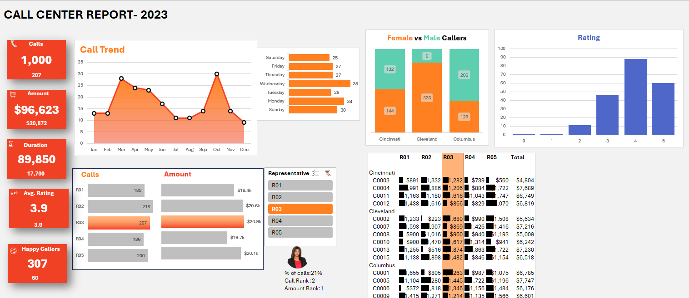

# 📞 Call Center Report - 2023

This folder presents an Excel-based analysis and dashboard for visualizing call center performance metrics.

## 📂 Files Included

### `Customer_Center_Report.xlsx`
An Excel file containing data related to:
- Total calls received
- Call durations and amounts
- Ratings and caller satisfaction
- Day-wise and city-wise breakdown
- Representative and center-wise performance
- Gender split of callers

The data has been cleaned and visualized using Excel’s built-in charts and dashboard tools.

---

## 📊 Dashboard Preview

Below is the dashboard created directly in Excel using this data:

### Dashboard Insights:
- 📈 **Monthly Call Trend**
- 🧑‍🤝‍🧑 **Female vs Male Callers (City-wise)**
- ⭐ **Customer Rating Distribution**
- 🧑‍💼 **Call Volume and Amount by Representative**
- 🏙️ **Center-wise Call and Revenue Summary**
- 📅 **Call Activity by Day of Week**

---

## 🔍 Getting Started

You can open the Excel file using Microsoft Excel or any compatible tool to:
- View the dashboard
- Explore raw data
- Perform further analysis or enhancements

---

## 🧰 Tools Used
- Microsoft Excel (2023 or later recommended)
- Charts, PivotTables, Conditional Formatting
- Data cleaning and layout design inside Excel

---

## 💡 Potential Add-Ons
- Convert Excel dashboard to Power BI for interactivity
- Add slicers and filters for dynamic exploration
- Integrate with real-time call tracking sheets or CRM exports

